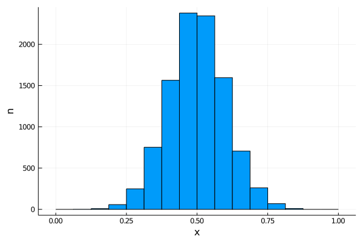
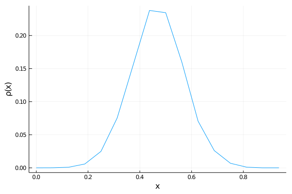
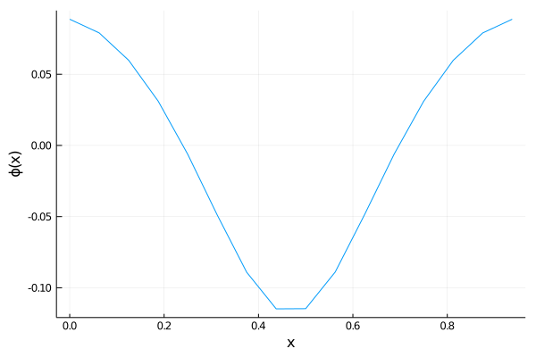
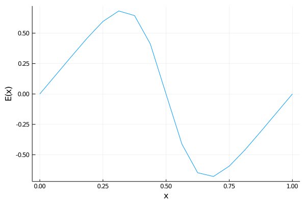

# Julia@Home Assignments

## 5. Traits and Closures

Implement a FFT-based 1D Poisson solver for the electrostatic potential. Use this potential to compute the electric field in the charged particle equations.

Note that the potential might have to be updated during one time step, e.g., for each internal stage of a Runge-Kutta method.
This can be achieved using callbacks, e.g., functions that are called at the beginning or end of a stage or sub-step of an integrator.
Extend the equation and integrator types and methods accordingly.


### Poisson Solver

The Poisson solver solves the following equation
$$
\Delta \phi = - \rho 
$$

First, we create a new file `src/poisson.jl` and include it in `Particles.jl`. 
We will use the `FFTW.jl` and `StatsBase.jl` packages in the Poisson solver and `StatsPlots.jl` for testing and debugging. So go to the package manager and all these dependencies.
In `Particles.jl`, import `FFTW` and `StatsBase`:
```julia
module Particles

using FFTW
using OffsetArrays
using StatsBase

export Equation, Simulation, run!
export ExplicitEuler
export PoissonSolver, solve!, eval_field

include("equation.jl")
include("integrators.jl")
include("simulation.jl")
include("poisson.jl")

end
```

Here, we already added the `export` statement for the `PoissonSolver` and its functions `solve!` and `eval_field` (which still need to be implemented).

The Poisson solver type stores everything that is needed to solve the Poisson equation:
    - the number of grid points `nx`,
    - the grid step size `Δx`,
    - the grid `xgrid`,
    - and two vectors for the right-hand side `ρ` and the solution `ϕ`, respectively

```julia
struct PoissonSolver{DT <: Real}
    nx::Int
    Δx::DT
    xgrid::Vector{DT}
    ρ::Vector{DT}
    ϕ::Vector{DT}

    function PoissonSolver{DT}(nx::Int) where {DT}
        Δx = 1/nx
        xgrid = collect(0:Δx:1)
        new(nx, Δx, xgrid, zeros(DT, nx), zeros(DT, nx))
    end
end
```

The constructor takes two argumens, the type `DT` and the number of grid points `nx`. All other fields are instantiated by the constructor.

We need two implement two functions:
    - one that solves the Poisson equation,
    - and one that evaluates the electric field


The Poisson equation is solved using FFT:
```julia
function solve!(p::PoissonSolver{DT}, x::AbstractVector{DT}) where {DT}
    h = fit(Histogram, mod.(x, 1), p.xgrid)
    p.ρ .= h.weights ./ length(x)
    ρ̂ = rfft(p.ρ)
    k² = [(i-1)^2 for i in eachindex(ρ̂)]
    ϕ̂ = - ρ̂ ./ k²
    ϕ̂[1] = 0
    p.ϕ .= irfft(ϕ̂, length(p.ρ))
    return p
end
```

First, we create a histogram of the particles using the `fit` function from `StatsBase`.
The result is scaled by the number of particles to obtain the charge density `ρ`.
We compute the real FFT of the charge density and compute the Laplace operator.
The inverse real FFT provides the electrostatic potential `ϕ`, which is stored in the `Poisson` struct.

*Remark*: For a more efficient implementation, all temporary arrays should be stored persistently in `PoissonSolver` and we should create a `plan_fft` and `plan_ifft` (see `AbstractFFTs.jl` for details).

*Remark*: In general, one would not like to restrict the domain to $(0,1)$.

The electric field is evaluated via a rather rough finite difference approach:
```julia
function eval_field(p::PoissonSolver{DT}, x::DT) where {DT}
    y = mod(x, one(x))
    i1 = floor(Int, y / p.Δx) + 1
    i2 = mod( ceil(Int, y / p.Δx), p.nx) + 1
    i1 == i2 && (i1 = i1-1)
    i1 == 0 && (i1 = lastindex(p.ϕ))
    return - (p.ϕ[i2] - p.ϕ[i1]) / p.Δx
end
```

We need to locate the position `x` in the grid and return the finite difference of the neighbouring potential values.

In `prototyping/poisson.jl` we write a small test script to verify if our Poisson solver works as expected:
```julia
using Particles
using StatsBase
using StatsPlots

# set grid resolution
nx = 16

# set number of particles and initialise random particles
n = 10000
x = randn(n)
v = randn(n)

# shift and scale particles positions to the interval [0,1]
xmax = ceil(maximum(abs.(v)))
x .+= xmax
x ./= 2*xmax

# solve Poisson equation
p = PoissonSolver{eltype(x)}(nx)
solve!(p, x)
```

The script is invoked from the `Particles` directory via
```
julia --project=. prototyping/poisson.jl
```

The particle histogram is plotted as follows:
```julia
xgrid = collect(0:p.Δx:1)
hx = fit(Histogram, x, xgrid)
plot(hx; legend=nothing, xlabel="x", ylabel="n")
savefig("poisson_histogram_x.png")
```



The charge density is computed by
```julia
plot(p.xgrid[1:end-1], p.ρ; legend=nothing, xlabel="x", ylabel="ρ(x)")
savefig("poisson_ρ.png")
```



The electrostatic potential comes from
```julia
plot(p.xgrid[1:end-1], p.ϕ; legend=nothing, xlabel="x", ylabel="ϕ(x)")
savefig("poisson_ϕ.png")
```



and the electric field from
```julia
plot(p.xgrid, x -> eval_field(p, x); legend=nothing, xlabel="x", ylabel="E(x)")
savefig("poisson_E.png")
```


