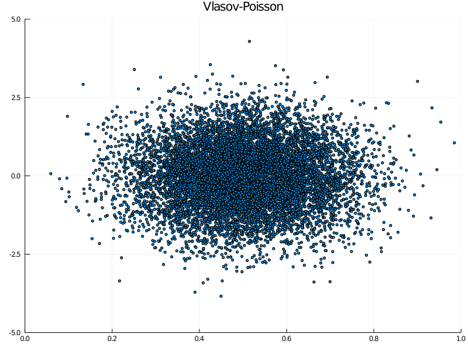

# Julia@Home Assignments

## 5. Traits and Closures

### Vlasov-Poisson

In the next step, we need to modify the charged particle simulation in `scripts/charged_particles.jl` to use the Poisson solver and the self-consistent electric field. 
Copy the script to `scripts/vlasov_poisson.jl`, add a parameter for the grid resolution, and strip down to 1d using the same initial conditions as in the Poisson solver test script:
```julia
# import Particles package
using Particles

# parameters
Δt = 0.1    # time step size
nt = 200    # number of time steps
np = 10000  # number of particles
nx = 16     # number of grid points

# random initial conditions
x₀ = randn(np)
v₀ = randn(np)

# shift x₀ to the interval [0,1]
xmax = ceil(maximum(abs.(x₀)))
x₀ .+= xmax
x₀ ./= 2*xmax

# concatenate x₀ and v₀
z₀ = hcat(x₀, v₀)'
```

Modify the Lorentz force, create a Poisson solver and add a closure for the vector field in the equation:
```julia
# vector field
function lorentz_force!(ż, z, p::PoissonSolver)
    ż[1] = z[2]
    ż[2] = eval_field(p, z[1])
end

# create Poisson solver
p = PoissonSolver{eltype(z₀)}(nx)
solve!(p, x₀)

# create an Equation instance
equ = Equation((ż, z) -> lorentz_force!(ż, z, p), z₀)

# create Simulation instance
sim = Simulation(equ, ExplicitEuler, Δt, nt)

# run simulation
z = sim()
```

Note that the integrator expects a vector field that takes two arguments `(ż, z)`, but the `lorentz_force!` function takes three arguments as it needs a `PoissonSolver` instance to compute the electric field.
In such situations one just creates a closure, that is an anonymous function, which has the desired interface and forwards the additional arguments:
```julia
(ż, z) -> lorentz_force!(ż, z, p)
```

The plotting is done by the following script:
```julia
# load Plots package
using Plots

# compute plot ranges
vmax = ceil(maximum(abs.(v₀)))
xlim = (0, 1)
vlim = (-vmax, +vmax)

# plot initial condition
scatter(mod.(z[1,:,0], 1), z[2,:,0],
        marker = 3,
        xlim = xlim,
        ylim = vlim,
        title = "Vlasov-Poisson",
        legend = false,
        size = (800, 600)
)

# save figure to file
savefig("vlasov_poisson_z₀.png")

# create animation
anim = @animate for i in 0:nt
    scatter(mod.(z[1,:,i], 1), z[2,:,i],
        marker = 3,
        xlim = xlim,
        ylim = vlim,
        title = "Vlasov-Poisson",
        legend = false,
        size = (800, 600)
    )
end

# save animation to file
gif(anim, "vlasov_poisson_anim.gif", fps=10)
```

The initial condition looks like



and here is the full animation


In order to provide flexible means for automatically updating the potential, we implement support for pre- and post-processing functions that are run before and after each timestep.
We extend the equation type by two fields, `f_pre` and `f_post`, that each hold either a function or `nothing`, the latter being the default:
```julia
struct Equation{DT <: Number, FT <: Function, FPRE <: Union{Function,Nothing},
                                              FPOST <: Union{Function,Nothing}}
    f::FT
    x₀::Array{DT,2}
    f_pre::FPRE
    f_post::FPOST

    function Equation(f::FT, x₀::AbstractArray{DT,2}; f_preproc::FPRE=nothing,
                      f_postproc::FPOST=nothing) where {DT, FT, FPRE, FPOST}
        new{DT, FT, FPRE, FPOST}(f, Array(x₀), f_preproc, f_postproc)
    end
end
```

In addition, we add two functions, each with two methods:
```julia
preprocessing(::Equation{<:Number, <:Function, Nothing}, ::AbstractArray) = nothing
postprocessing(::Equation{<:Number, <:Function, <:Union{Function,Nothing}, Nothing}, ::AbstractArray) = nothing

preprocessing(equ::Equation{<:Number, <:Function, <:Function}, x₀::AbstractArray) = equ.f_pre(x₀)
postprocessing(equ::Equation{<:Number, <:Function, <:Union{Function,Nothing}, <:Function}, x₁::AbstractArray) = equ.f_post(x₁)
```

We use multiple dispatch to distinguish between equations that have pre- and post-processing functions and those which don't: if a function is present it is called, otherwise `nothing` happens.
In the `run!` method of `Simulation` we need to call these functions in order for the pre- and post-processing to occur: 
```julia
function run!(sim::Simulation{DT}) where {DT}
    for n in eachtimestep(sim)
        @views preprocessing(sim.equ, sim.x[:,:,n-1])
        for i in eachsample(sim)
            @views integrate_step!(sim.int, sim.equ, sim.x[:,i,n-1], sim.x[:,i,n])
        end
        @views postprocessing(sim.equ, sim.x[:,:,n])
    end
    return sim.x
end
```

Now we only need to add a pre-processing function to our `Equation` instance for the Vlasov-Poisson problem:
```julia
# create an Equation with callbacks
equ = Equation((ż, z) -> lorentz_force!(ż, z, p), z₀; f_preproc = z -> solve!(p, z[1,:]))
```

...and we can run the script again...


